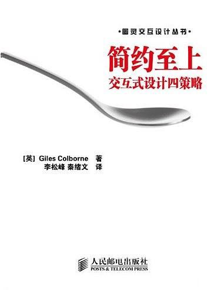
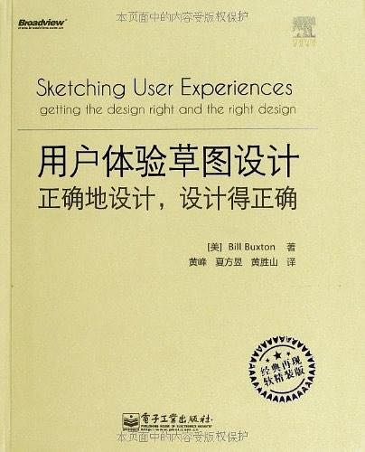

# 交互设计书单

|cover|intro|notes|purchase|
|:--|:--|:--|:--:|
||《web信息架构:设计大型网站》|`进阶`|[京东](https://search.jd.com/Search?keyword=web%e4%bf%a1%e6%81%af%e6%9e%b6%e6%9e%84%3a%e8%ae%be%e8%ae%a1%e5%a4%a7%e5%9e%8b%e7%bd%91%e7%ab%99&enc=utf-8) / [当当](http://search.dangdang.com/?key=web%e4%bf%a1%e6%81%af%e6%9e%b6%e6%9e%84%3a%e8%ae%be%e8%ae%a1%e5%a4%a7%e5%9e%8b%e7%bd%91%e7%ab%99)|
|| 《don't make me think》   可用性设计是Web设计中最重要也是最困难的一项任务。《点石成金》的作者根据自己多年从业的经验，剖析用户的心理，在用户使用的模式、为浏览进行设计、导航设计、主页布局、可用性测试等方面提出了许多独特的观点，并给出了大量简单、易行的可用性设计的建议。这本书短小精悍，语言轻松诙谐，书中穿插大量色彩丰富的屏幕截图、趣味丛生的卡通插图以及包含大量信息的图表，使枯燥的设计原理变得平易近人。 | `入门` |[京东](https://search.jd.com/Search?keyword=don't%20make%20me%20think&enc=utf-8) / [当当](http://search.dangdang.com/?key=don't%20make%20me%20think) |
|| 《简约至上》 | `入门` |[京东](https://search.jd.com/Search?keyword=《简约至上》&enc=utf-8) / [当当](http://search.dangdang.com/?key=《简约至上》) |
|| 《UCD火花集》  | `入门` |[京东](https://search.jd.com/Search?keyword=UCD火花集&enc=utf-8) / [当当](http://search.dangdang.com/?key=UCD火花集) |
|| 《用户体验的要素》 | `入门` |[京东](https://search.jd.com/Search?keyword=用户体验的要素&enc=utf-8) / [当当](http://search.dangdang.com/?key=用户体验的要素) |
|| 《用户体验草图设计：正确地设计，设计得正确》 | `入门` |[京东](https://search.jd.com/Search?keyword=用户体验草图设计&enc=utf-8) / [当当](http://search.dangdang.com/?key=用户体验草图设计) |
|| 《Web表单设计：点石成金的艺术》 | `入门` |[京东](https://search.jd.com/Search?keyword=Web表单设计：点石成金的艺术&enc=utf-8) / [当当](http://search.dangdang.com/?key=Web表单设计：点石成金的艺术) |
|| 《用户体验度量》 | `进阶` |[京东](https://search.jd.com/Search?keyword=用户体验度量&enc=utf-8) / [当当](http://search.dangdang.com/?key=用户体验度量) |
|| 《交互设计：原理与方法》  | `进阶` |[京东](https://search.jd.com/Search?keyword=交互设计：原理与方法&enc=utf-8) / [当当](http://search.dangdang.com/?key=交互设计：原理与方法) |
|| 《About Face 4: 交互设计精髓》 | `进阶` |[京东](https://search.jd.com/Search?keyword=About%20Face%204&enc=utf-8) / [当当](http://search.dangdang.com/?key=About%20Face%204) |
