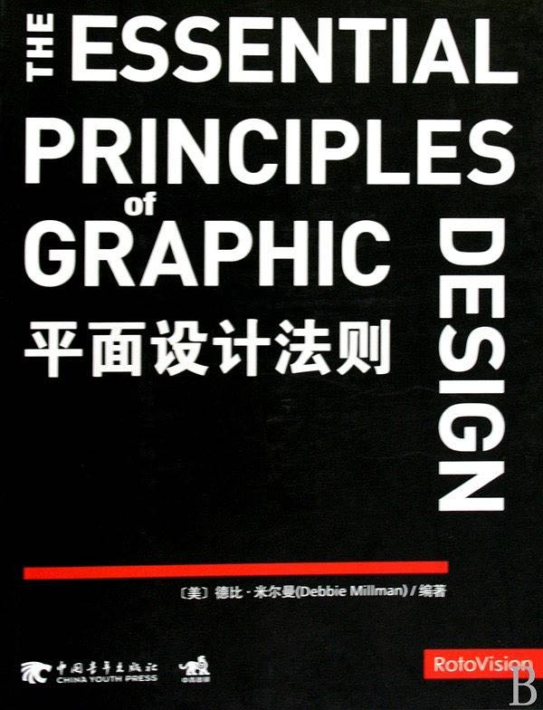
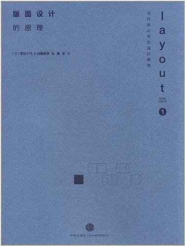
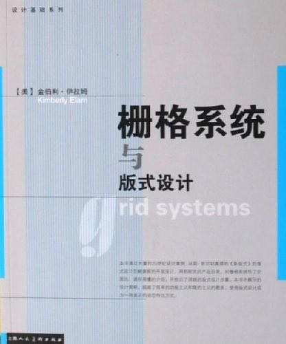

# 界面设计书单

|cover|intro|notes|purchase|
|:--|:--|:--|:--:|
|| 《GUI设计禁忌2.0》 | `入门` |[京东](https://search.jd.com/Search?keyword=GUI设计禁忌2.0&enc=utf-8) / [当当](http://search.dangdang.com/?key=GUI设计禁忌2.0) |
|| 《平面设计法则》 | `入门` |[京东](https://search.jd.com/Search?keyword=平面设计法则&enc=utf-8) / [当当](http://search.dangdang.com/?key=平面设计法则) |
|| 《Web表单设计：点石成金的艺术》 | `入门` |[京东](https://search.jd.com/Search?keyword=Web表单设计%ef%bc%9a点石成金的艺术&enc=utf-8) / [当当](http://search.dangdang.com/?key=Web表单设计%ef%bc%9a点石成金的艺术) |
|| 《版面设计的原理》 | `基础`  / `进阶` |[京东](https://search.jd.com/Search?keyword=版面设计的原理&enc=utf-8) / [当当](http://search.dangdang.com/?key=版面设计的原理) |
|| 《栅格系统与版式设计》 /  本书通过大量的20世纪设计案例，从简·奇尔切奥得的《新版式》的版式设计到鲍豪斯的平面设计，再到耐克的产品目录，对栅格系统作了全面的、通俗易懂的介绍，并给出了详细的版式设计步骤。本书中展示的设计超越了简单的功能主义和简约主义的教条，使得版式设计成为一种真正的动态传达方式。| `基础` / `进阶` |[京东](https://search.jd.com/Search?keyword=栅格系统与版式设计&enc=utf-8) / [当当](http://search.dangdang.com/?key=栅格系统与版式设计) |