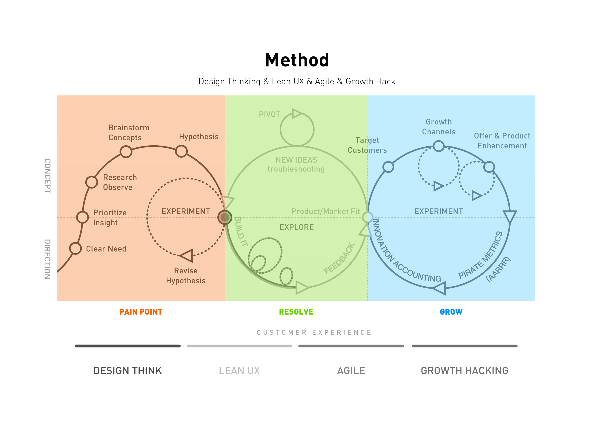

# UED流程

<!-- 注： 部分图片过大，文字难以辨识，请在图片点击右键 → 选择`在新标签页打开图片` 以查看大图。
 -->

<!-- ## UED 执行流程 -->

## 执行流程

UED组实际执行参考 nordstorm 的流程，完善并补齐各节点工作，控制、检验UED所涉及的各方面工作，由于流程复杂，涉及思想、方法等内容过多，执行成本高。故uex将结合nordstorm 创新实验室的流程结合公司实际情况，简化的对外流程如下：

[UED负责(协调)人分配--公司内网](http://wiki.jiandan100.cn:8090/pages/viewpage.action?pageId=278532118)

## UED内部流程

源自 Nordstrom Innovation Lab，结合设计思维,精益用户体验,敏捷,增长黑客的产品流程。

### UED产出

产出文档模板(内网)部分见 <http://ued.jovi.cc/d/b54065113f4a417e8dc6/>

## nordstorm流程解读

### 坐标轴

#### x坐标轴

- Pain point ：用户痛点 ，理由设计思维的方法论查找用户痛点，测试验证解决方案。
- Resolve ：解决方案，使用精益用户体验结合敏捷开发完成解决方案的研发、迭代。
- Grow： 用户增长，利用增长黑客的指导思想和海盗模型完成用户增长目标。

#### y坐标轴

- Concept：这部分主要是概念、概念形成
- Direction：这部分是明确的方向和具体任务的执行

### 四个组成部分

流程中包含的四种思想/方法论的四个组成部分：

#### Design thinking

[了解更多](content/references.md#referDesignThinking)

#### lean ux

[了解更多](content/references.md#referLeanUx)

#### agile

[了解更多](content/references.md#referAgile)

#### growth Hack

[了解更多](content/references.md#referGrowthHack)

<!-- #### 旧流程

 -->