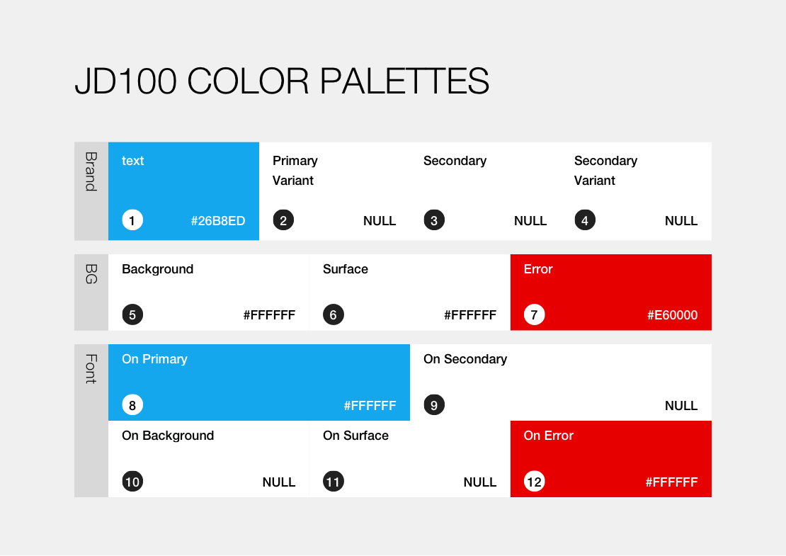
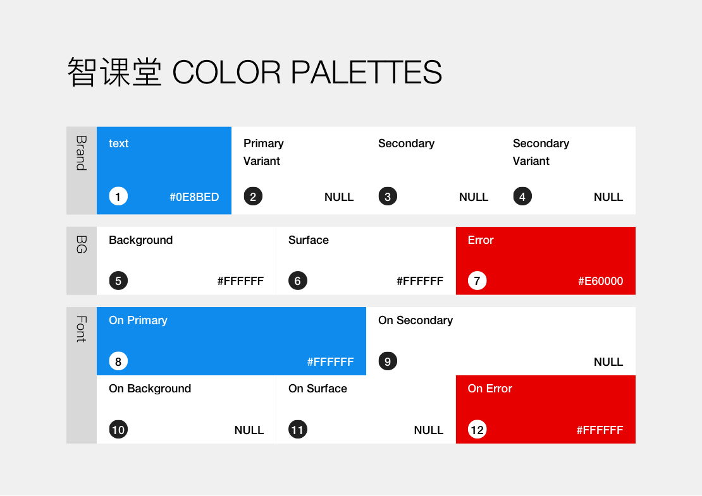
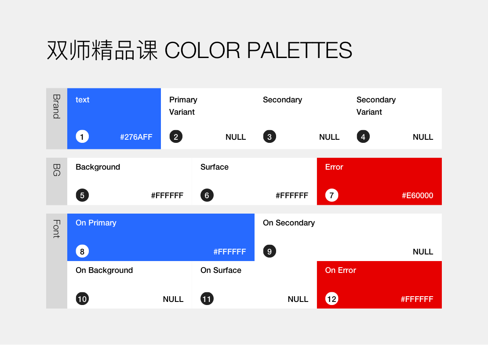
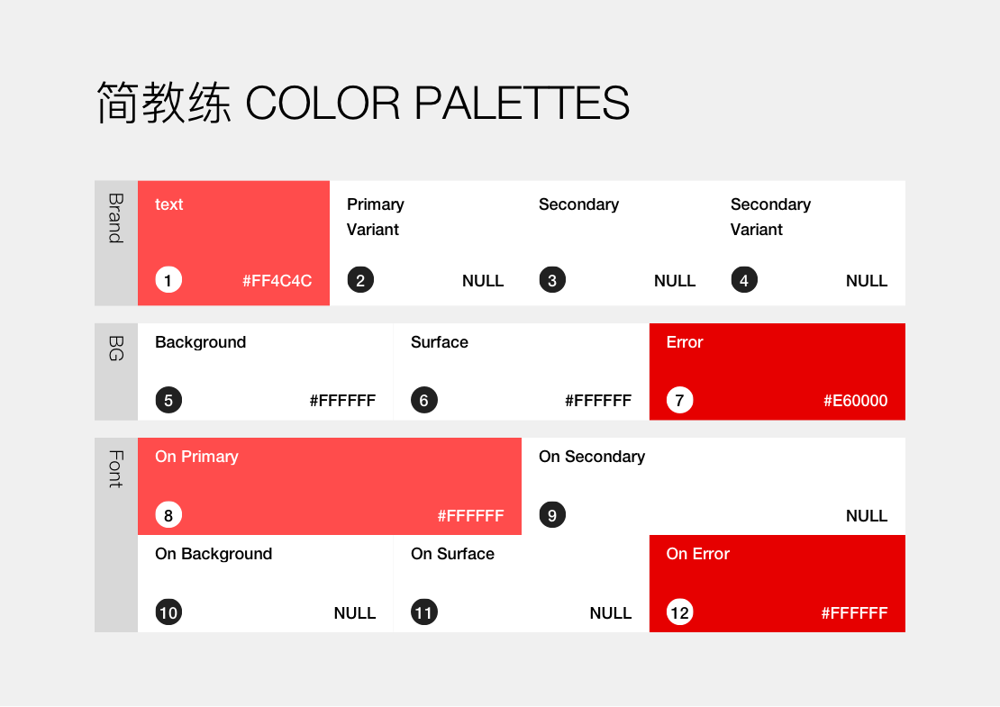

# 颜色

## 简单学习网颜色系统

### 主色

|**theme**|primary|secondary|variant|other|
|:--| :-- | :-- | :-- | :-- |
|预览|  | - | - | - |
|RGB色值|`rgb(20,167,237)`|-|-|-|
|HEX色值|`#26B8ED`|-|-|-|

### 配色体系

## 智课堂颜色系统

### 智课堂·主色

|**theme**|primary|secondary|variant|other|
|:--| :-- | :-- | :-- | :-- |
|预览|  | - | - | - |
|RGB色值|`rgb(14,139,237)`|-|-|-|
|HEX色值|`#0E8BED`|-|-|-|

### 智课堂·配色体系

## 简而优产品线

### 双师精品课颜色系统

#### 双师精品课·主色

|**theme**|primary|secondary|variant|other|
|:--| :-- | :-- | :-- | :-- |
|预览|  | - | - | - |
|RGB色值|`rgb(39,106,255)`|-|-|-|
|HEX色值|`#276AFF`|-|-|-|

#### 双师精品课·配色体系

### 简教练颜色系统

#### 简教练·主色

|**theme**|primary|secondary|variant|other|
|:--| :-- | :-- | :-- | :-- |
|预览|  | - | - | - |
|RGB色值|`rgb(255,76,76)`|-|-|-|
|HEX色值|`#FF4C4C`|-|-|-|

#### 简教练·配色体系

## 颜色使用
