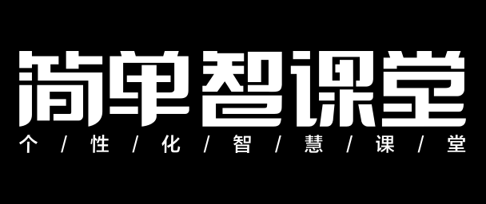

# logo

<!-- ## 公司logo

|一般使用|在深色背景上使用|有限空间内使用图形logo|
|:--:|:--:|:--:|
|   下载源文件:   [jpg](/assets/attachment/logos/{replace}-jpg.zip)  · [png](/assets/attachment/logos/{replace}-png.zip)· [svg](/assets/attachment/logos/{replace}-svg.zip)  · [eps](/assets/attachment/logos/{replace}-eps.zip)  |   下载源文件:   [jpg](/assets/attachment/logos/{replace}-inverse-jpg.zip)  · [png](/assets/attachment/logos/{replace}-inverse-png.zip)· [svg](/assets/attachment/logos/{replace}-inverse-svg.zip)  · [eps](/assets/attachment/logos/{replace}-inverse-eps.zip) |   下载源文件:   [jpg](/assets/attachment/logos/{replace}-shapeonly-jpg.zip)  · [png](/assets/attachment/logos/{replace}-shapeonly-png.zip)· [svg](/assets/attachment/logos/{replace}-shapeonly-svg.zip)  · [eps](/assets/attachment/logos/{replace}-shapeonly-eps.zip) | -->

## 子品牌logo

<!-- ### 简单学习网

|一般使用|在深色背景上使用|有限空间内使用图形logo|
|:--:|:--:|:--:|
|   下载源文件:   [jpg](/assets/attachment/logos/{replace}-jpg.zip)  · [png](/assets/attachment/logos/{replace}-png.zip)· [svg](/assets/attachment/logos/{replace}-svg.zip)  · [eps](/assets/attachment/logos/{replace}-eps.zip)  |   下载源文件:   [jpg](/assets/attachment/logos/{replace}-inverse-jpg.zip)  · [png](/assets/attachment/logos/{replace}-inverse-png.zip)· [svg](/assets/attachment/logos/{replace}-inverse-svg.zip)  · [eps](/assets/attachment/logos/{replace}-inverse-eps.zip) |   下载源文件:   [jpg](/assets/attachment/logos/{replace}-shapeonly-jpg.zip)  · [png](/assets/attachment/logos/{replace}-shapeonly-png.zip)· [svg](/assets/attachment/logos/{replace}-shapeonly-svg.zip)  · [eps](/assets/attachment/logos/{replace}-shapeonly-eps.zip) | -->

### 智课堂

|一般使用|在深色背景上使用|
|:--:|:--:|
|   下载源文件:   [jpg](../../assets/attachment/logos/logo__zkt-jpg.zip)  · [png](../../assets/attachment/logos/logo__zkt-png.zip)· [svg](../../assets/attachment/logos/logo__zkt-svg.zip)  · [eps](../../assets/attachment/logos/logo__zkt-eps.zip)  |   下载源文件:   [jpg](../../assets/attachment/logos/logo__zkt-inverse-jpg.zip)  · [png](../../assets/attachment/logos/logo__zkt-inverse-png.zip)· [svg](../../assets/attachment/logos/logo__zkt-inverse-svg.zip)  · [eps](../../assets/attachment/logos/logo__zkt-inverse-eps.zip) |

### 简而优产品线

<!-- #### 双师精品课

|一般使用|在深色背景上使用|有限空间内使用图形logo|
|:--:|:--:|:--:|
|   下载源文件:   [jpg](/assets/attachment/logos/{replace}-jpg.zip)  · [png](/assets/attachment/logos/{replace}-png.zip)· [svg](/assets/attachment/logos/{replace}-svg.zip)  · [eps](/assets/attachment/logos/{replace}-eps.zip)  |   下载源文件:   [jpg](/assets/attachment/logos/{replace}-inverse-jpg.zip)  · [png](/assets/attachment/logos/{replace}-inverse-png.zip)· [svg](/assets/attachment/logos/{replace}-inverse-svg.zip)  · [eps](/assets/attachment/logos/{replace}-inverse-eps.zip) |   下载源文件:   [jpg](/assets/attachment/logos/{replace}-shapeonly-jpg.zip)  · [png](/assets/attachment/logos/{replace}-shapeonly-png.zip)· [svg](/assets/attachment/logos/{replace}-shapeonly-svg.zip)  · [eps](/assets/attachment/logos/{replace}-shapeonly-eps.zip) | -->

<!-- #### 简教练

|一般使用|在深色背景上使用|有限空间内使用图形logo|
|:--:|:--:|:--:|
|   下载源文件:   [jpg](/assets/attachment/logos/{replace}-jpg.zip)  · [png](/assets/attachment/logos/{replace}-png.zip)· [svg](/assets/attachment/logos/{replace}-svg.zip)  · [eps](/assets/attachment/logos/{replace}-eps.zip)  |   下载源文件:   [jpg](/assets/attachment/logos/{replace}-inverse-jpg.zip)  · [png](/assets/attachment/logos/{replace}-inverse-png.zip)· [svg](/assets/attachment/logos/{replace}-inverse-svg.zip)  · [eps](/assets/attachment/logos/{replace}-inverse-eps.zip) |   下载源文件:   [jpg](/assets/attachment/logos/{replace}-shapeonly-jpg.zip)  · [png](/assets/attachment/logos/{replace}-shapeonly-png.zip)· [svg](/assets/attachment/logos/{replace}-shapeonly-svg.zip)  · [eps](/assets/attachment/logos/{replace}-shapeonly-eps.zip) | -->
