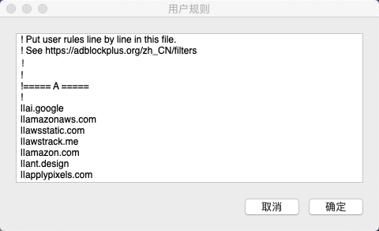

# shadowsocks PAC rule

## 使用方法

1. 打开软件，选择 `编辑PAC用户自定义规则…`

1. 复制下方的代码，添加到输入框内

这样就可以再PAC自动模式下也会通过代理访问列表中的网站，不需要打开全局模式（打开全局模式会导致本地能很快打开的网站也要通过代理访问，很大概率会更慢，严重影响使用体验。），这些网站并没有被屏蔽，只是线路问题导致访问很慢。

通过定义PAC文件，可以不使用全局代理模式，也可以通过代理访问线路不好的国外站点。平时有经常访问的网站，不在屏蔽列表的，也可以自己手动添加到PAC列表内，优化访问体验。

[点击查看最新自定义规则](../user-rule.txt ':include')